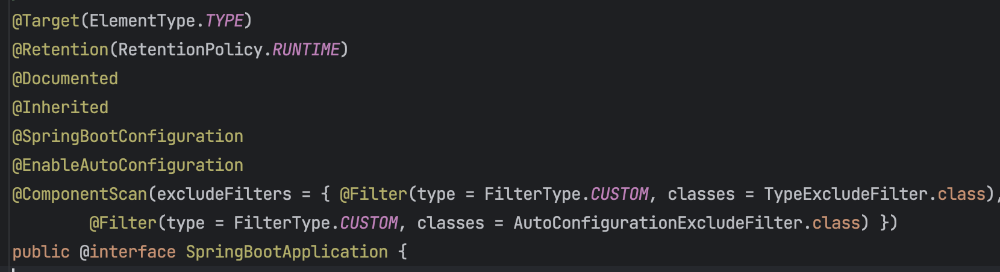

# 📍 키워드

- Spring 기본
    - Spring vs Spring MVC vs Spring Boot
        - https://www.inflearn.com/blogs/3315
        - https://www.elancer.co.kr/blog/view?seq=158
        - https://www.codestates.com/blog/content/%EC%8A%A4%ED%94%84%EB%A7%81-%EC%8A%A4%ED%94%84%EB%A7%81%EB%B6%80%ED%8A%B8
        - https://blog.naver.com/PostView.nhn?blogId=sthwin&logNo=221271008423
        - MVC1 vs MVC2
            - https://chanhuiseok.github.io/posts/spring-3/
            - https://lahezy.tistory.com/64
        - Spring Boot를 사용하는 이유, 자동설정 원리
            - https://mangkyu.tistory.com/208
            - https://wildeveloperetrain.tistory.com/292
            - https://hanseom.tistory.com/333
    - 디스패처 서블릿
        - https://mangkyu.tistory.com/18
        - https://mangkyu.tistory.com/216
    - IoC
    - DI
        - https://mangkyu.tistory.com/150
        - https://mangkyu.tistory.com/125
    - Bean, Component
        - https://medium.com/sjk5766/bean%EA%B3%BC-component-%EC%B0%A8%EC%9D%B4-96a8d0533bfd
        - `@Component` `@Service` `@Controller`
        - 생성 주기
    - Container
        - https://ittrue.tistory.com/220
        - https://docs.spring.io/spring-framework/reference/core/beans/introduction.html
    - VO vs DTO vs DAO

 

# 📍 예상 질문

Spring 프레임워크의 주요한 특징은 무엇인가요?

1. 제어의 역전 (IoC, Inversion of Control): Spring 프레임워크는 객체의 생성부터 생명주기 관리까지 모든 것을 관리하는 IoC 컨테이너를 제공합니다. 이를 통해 개발자는 비즈니스 로직에만 집중할 수 있게 됩니다.
2. 의존성 주입 (DI, Dependency Injection): Spring 프레임워크는 의존성 주입을 지원해, 객체 간의 결합도를 낮추고 코드의 재사용성과 테스트 용이성을 향상시킵니다.
3. AOP (Aspect-Oriented Programming): Spring은 관점 지향 프로그래밍을 지원해, 핵심 비즈니스 로직과 각종 공통 관심사(로깅, 보안 등)를 분리하여 코드의 가독성과 유지보수성을 향상시킵니다.
4. 포괄적인 데이터 접근 지원: JDBC, JPA, Hibernate 등 다양한 데이터 접근 기술에 대한 추상화 계층을 제공하여 데이터 접근을 쉽고 효율적으로 할 수 있게 돕습니다.
5. 트랜잭션 관리: 선언적 트랜잭션 관리를 지원해, 개발자가 트랜잭션 관리에 대한 부담을 덜 수 있게 합니다.
6. 스프링 MVC: 강력한 웹 애플리케이션을 빠르고 쉽게 개발할 수 있도록 돕는 Spring의 MVC 프레임워크를 제공합니다.
- 이와 같이, Spring 프레임워크는 개발자가 업무에 집중할 수 있도록 다양한 기능을 제공하며, 이를 통해 개발 효율성과 코드의 품질을 향상시키는데 크게 기여합니다.

Spring, Spring MVC, 그리고 Spring Boot의 주요 차이점은 무엇인가요?

- Spring, Spring MVC, 그리고 Spring Boot는 모두 Spring 프레임워크를 기반으로 하지만 각각의 목적과 사용법이 다릅니다.
1. Spring: Spring은 제어의 역전(IoC), 의존성 주입(DI), 관점 지향 프로그래밍(AOP), 트랜잭션 관리 등 다양한 기능을 제공합니다. 그러나 Spring만을 사용하면 개발자가 많은 설정을 직접 해야하며, 이는 복잡하고 시간이 많이 소요될 수 있습니다.
2. Spring MVC: Spring MVC는 Spring 프레임워크의 일부로, 웹 애플리케이션 개발을 위한 Model-View-Controller 패턴을 구현한 것입니다. HTTP 요청을 처리하는 컨트롤러, 뷰를 렌더링하는 뷰, 그리고 비즈니스 로직을 처리하는 모델로 구성되어 있습니다.
3. Spring Boot: Spring Boot는 Spring 기반 애플리케이션을 빠르게 시작하고 쉽게 설정할 수 있도록 도와주는 도구입니다. 개발자가 직접 설정해야 하는 부분을 최소화하고, 자동 설정, 내장된 서버 제공, Starter 의존성 관리 등을 통해 개발자의 생산성을 크게 향상시킵니다.
- 따라서, 이 세 가지는 각각의 목적과 역할에 따라 선택하고 사용하면 됩니다. Spring은 전반적인 애플리케이션 개발을 위한 프레임워크, Spring MVC는 웹 애플리케이션 개발을 위한 프레임워크, 그리고 Spring Boot는 Spring 기반 애플리케이션 개발을 보다 쉽고 빠르게 할 수 있도록 도와주는 도구라고 할 수 있습니다.

Spring Boot를 사용할 때 얻는 이점은 무엇인가요?

1. 자동 설정: Spring Boot는 Classpath 설정, 다양한 Spring 설정, 그리고 일반적으로 애플리케이션 개발에 필요한 기본적인 설정들을 자동으로 설정해줍니다. 이를 통해 개발자는 설정에 대한 부담을 덜고, 비즈니스 로직에 집중할 수 있습니다.
2. 내장 서버 제공: Spring Boot는 내장 톰캣, 제티, 언더토우와 같은 서버를 제공합니다. 이를 통해 별도의 WAS를 설치하고 설정할 필요 없이 애플리케이션을 실행시키는 것만으로 웹 애플리케이션을 구동할 수 있습니다.
3. 의존성 관리: Spring Boot는 일반적으로 사용되는 다양한 라이브러리의 호환 가능한 버전들을 관리해줍니다. 이를 통해 개발자는 라이브러리의 버전 관리에 대한 부담을 덜 수 있습니다.
- 이러한 이점들 덕분에 Spring Boot는 개발 시간을 크게 단축시키고, 개발자의 생산성을 높여주며, 애플리케이션의 품질을 향상시키는 데 크게 기여합니다.

Spring Boot의 자동설정 원리를 설명해줄 수 있나요?

- Spring Boot의 자동 설정은 '@EnableAutoConfiguration' 어노테이션을 통해 이루어집니다. 이 어노테이션은 Spring Boot가 클래스패스에 있는 라이브러리들, Bean 정의들, 그리고 다양한 프로퍼티 설정들을 기반으로 애플리케이션의 컨텍스트를 자동으로 설정하도록 돕습니다.
- 컴포넌트 스캔: Spring Boot 애플리케이션은 시작 시 '@ComponentScan' 어노테이션을 통해 '@Component', '@Service', '@Controller', '@Repository' 등을 포함하는 클래스들을 찾아내고 Bean으로 등록합니다.
- 이런 방식으로, Spring Boot는 개발자가 직접 설정해야 할 부분을 최소화하고, 개발 과정을 간소화하면서도 필요한 설정들을 자동으로 적용할 수 있게 합니다. 이는 개발자의 생산성을 크게 향상시키며, 애플리케이션의 안정성과 효율성을 높입니다.

    

MVC1과 MVC2 패턴의 차이점은 무엇인가요?

- MVC1과 MVC2는 웹 애플리케이션을 설계하는 데 사용되는 아키텍처 패턴입니다. 이 둘의 주요 차이점은 컨트롤러의 역할과 분리 수준에 있습니다.
- MVC1 패턴은 JSP 페이지 하나가 모델과 뷰, 그리고 컨트롤러의 역할을 모두 담당하는 구조입니다. 즉, 사용자의 요청을 받아 처리하는 컨트롤러의 역할과 데이터를 표시하는 뷰의 역할이 분리되지 않은 구조입니다. 이로 인해 JSP 페이지가 비즈니스 로직까지 담당하게 되어 코드의 복잡성이 증가하고, 유지보수가 어려워질 수 있습니다.
- 반면, MVC2 패턴은 모델, 뷰, 컨트롤러가 엄격하게 분리된 구조입니다. 컨트롤러는 사용자의 요청을 받아 처리하고, 모델은 비즈니스 로직을 담당하며, 뷰는 결과를 사용자에게 표시하는 역할을 합니다. 이렇게 역할이 분리되어 있으므로 각 컴포넌트의 재사용성과 유지보수성이 향상됩니다.
- Spring MVC에서 사용하는 패턴은 MVC2 패턴입니다. 이를 통해 개발자는 비즈니스 로직과 사용자 인터페이스를 분리하여 개발할 수 있고, 이는 애플리케이션의 유지보수성과 확장성을 높여줍니다.

DispatcherServlet의 역할과 작동 원리에 대해 설명해 주세요.

- DispatcherServlet은 Spring MVC 프레임워크의 핵심 요소로, 클라이언트의 요청을 적절한 컨트롤러에게 전달하는 역할을 합니다. 그 과정은 대략 다음과 같습니다:
1.  요청 수신: 클라이언트로부터 HTTP 요청을 받습니다. 이 요청은 DispatcherServlet에게 전달됩니다.
2. 핸들러 매핑: DispatcherServlet은 핸들러 매핑을 통해 요청을 처리할 적절한 컨트롤러를 찾습니다. 이는 URL 패턴, HTTP 메소드 등 요청의 특징을 기반으로 합니다.
3. 컨트롤러 실행: 매핑된 컨트롤러의 메소드가 실행되어 요청을 처리합니다. 이 때 필요한 모델 데이터를 생성하거나 변경할 수 있으며, 응답에 사용될 뷰 이름을 결정합니다.
4. 뷰 렌더링: 컨트롤러가 반환한 뷰 이름을 바탕으로 뷰 리졸버가 실제 뷰를 찾아내고, 그 뷰에 모델 데이터를 전달하여 뷰가 렌더링됩니다.
5. 응답 반환: 렌더링된를 클라이언트에게 HTTP 응답으로 반환합니다.
- DispatcherServlet은 클라이언트의 요청을 적절 컨트롤러에게 전달하고, 처리 결과를 클라이언트에게 응답하는 역할을 합니다. 이를 통해 Spring MVC는 사용자의 요청을 효율적으로 처리하며, 개발자는 비즈니스 로직에 집중할 수 있습니다.

여러 요청이 들어온다고 가정할 때, DispatcherServlet은 한번에 여러 요청을 모두 받을 수 있나요?

- 네, 그렇습니다. DispatcherServlet은 여러 요청이 동시에 들어와도 각 요청을 별도의 스레드에서 처리합니다. 이는 서블릿 컨테이너가 HTTP 요청이 들어올 때마다 새로운 스레드를 생성하거나 기존의 스레드 풀에서 스레드를 가져와 요청을 처리하기 때문입니다.
- 따라서, 한 번에 여러 요청이 들어오더라도, 각 요청은 독립적으로 처리되며 서로 간섭하지 않습니다. 이는 웹 애플리케이션에서 동시성을 관리하고, 고성능을 유지하는 데 핵심적인 역할을 합니다.

수많은 @Controller 를 DispatcherServlet은 어떻게 구분 할까요?

- DispatcherServlet은 'HandlerMapping'이라는 인터페이스를 통해 적절한 컨트롤러를 찾아냅니다. HandlerMapping은 클라이언트의 요청을 처리할 수 있는 핸들러, 즉 @Controller를 찾아주는 역할을 합니다.
- Spring MVC에서는 주로 RequestMappingHandlerMapping을 사용하는데, 이는 @RequestMapping 어노테이션이 붙은 메소드를 찾아냅니다. 클라이언트로부터 들어온 요청의 URL, HTTP 메소드, 파라미터 등을 분석하여 이에 매칭되는 @RequestMapping 정보를 가진 컨트롤러의 메소드를 찾습니다.
- 따라서, DispatcherServlet은 HandlerMapping을 통해 수많은 @Controller 중에서 요청을 처리할 적절한 컨트롤러를 구분하고, 해당 메소드를 실행하여 요청을 처리하게 됩니다.

Spring Bean이란 무엇인가요?

- Spring Bean은 Spring IoC(Inversion of Control) 컨테이너에 의해 인스턴스화, 조립, 관리되는 객체를 말합니다.
- Spring Bean은 일반적으로 애플리케이션의 핵심 기능을 수행하는 객체들로, Spring IoC 컨테이너에 의해 관리되므로 개발자는 Bean의 생명주기 관리에 신경 쓸 필요가 없습니다.
- Bean은 Spring의 applicationContext.xml 파일이나 Java 기반의 설정 파일에서 정의하며, '@Component', '@Service', '@Repository', '@Controller' 등의 어노테이션을 통해 자동으로 스캔되어 Bean으로 등록될 수도 있습니다.
- Spring Bean은 필요에 따라 싱글톤 등 다양한 스코프를 가질 수 있으며, 의존성 주입(Dependency Injection)을 통해 다른 Bean과 관계를 맺을 수 있습니다. 이런 특징들 덕분에 Spring Bean은 애플리케이션의 느슨한 결합도와 확장성, 테스트 용이성 등을 지원합니다.

왜 Bean 덕분에 느슨한 결합도와 확장성를 얻을 수 있는건가요? 

- 빈을 사용함으로써 느슨한 결합도(loose coupling)와 확장성을 얻을 수 있는 이유는 Spring의 '의존성 주입(Dependency Injection, DI)' 기능 때문입니다.
1. 느슨한 결합도: 의존성 주입을 통해 객체는 직접적으로 의존하는 객체를 생성하거나 찾는 대신 Spring 컨테이너로부터 필요한 의존성을 주입받습니다. 이로 인해 객체 간의 결합도가 낮아지고, 코드의 변경이 다른 부분에 미치는 영향을 최소화할 수 있습니다. 이는 코드의 유지 관리를 더 쉽게 만들어 줍니다.
2. 확장성: 느슨한 결합도는 코드의 확장성을 향상시킵니다. 예를 들어, 특정 인터페이스를 구현하는 빈을 다른 빈으로 교체하고 싶을 때, Spring 설정만 변경하면 됩니다. 이는 코드의 수정 없이 시스템의 일부를 변경하거나 확장할 수 있게 해줍니다.

Spring Bean을 사용하는 이유가 무엇인가요?

1. 의존성 관리: Spring 컨테이너가 Bean의 생성과 소멸을 관리하며, 의존성 주입(Dependency Injection)을 통해 Bean 간의 의존성을 관리합니다. 이를 통해 개발자는 객체의 생명주기와 의존성에 대해 신경 쓸 필요 없이 비즈니스 로직에 집중할 수 있습니다.
2. 싱글톤 패턴 적용: Spring 컨테이너는 기본적으로 Bean을 싱글톤으로 관리합니다. 이를 통해 애플리케이션 내에서 해당 Bean의 인스턴스가 하나만 존재하게 되므로, 메모리 사용량을 줄이고 효율성을 높일 수 있습니다.
3. AOP 지원: Spring Bean은 관점 지향 프로그래밍(AOP)을 적용할 수 있습니다. 이를 통해 트랜잭션 관리, 로깅, 보안 등의 공통 관심사를 분리하고, 핵심 비즈니스 로직에 집중할 수 있습니다.
4. 테스트 용이성: 의존성 주입을 통해 테스트 시 필요한 의존 객체를 쉽게 주입할 수 있어, 단위 테스트를 수행하기 편리합니다.

Bean의 생명주기(Lifecycle)에 대해 설명해주세요.

1. 인스턴스화: 먼저, Spring 컨테이너는 Bean 정의를 바탕으로 Bean 인스턴스를 생성합니다.
2. 의존성 주입: 생성된 Bean 인스턴스에 필요한 의존성들을 주입합니다. 이는 setter 메소드나 생성자를 통해 이루어집니다.
5. 초기화 메소드 실행: Bean이 InitializingBean 인터페이스를 구현하고 있다면, afterPropertiesSet 메소드가 실행됩니다. 또는 @PostConstruct 어노테이션이 붙은 메소드 또는 custom init 메소드가 실행됩니다.
6. BeanPostProcessor의 postProcessAfterInitialization 실행: 초기화 메소드 실행 후, BeanPostProcessor의 postProcessAfterInitialization 메소드가 실행됩니다.
7. Bean 사용: 이제 완전히 초기화된 Bean은 사용될 준비가 되었고, 필요에 따라 사용됩니다.
8. 소멸 메소드 실행: ApplicationContext가 종료되면서 Bean이 소멸될 때, Bean이 DisposableBean 인터페이스를 구현하고 있다면, destroy 메소드가 실행됩니다. 또는 @PreDestroy 어노테이션이 붙은 메소드 또는 custom destroy 메소드가 실행됩니다.

스프링 Bean의 Scope에 대해서 설명해주세요.

- Spring Bean의 Scope는 Bean이 생성되고 사용되는 방식을 결정합니다. Spring에서는 주로 다음 다섯 가지 Scope를 제공합니다:
1. 싱글톤(Singleton): 이 Scope는 기본적으로 설정되며, Spring 컨테이너당 하나의 Bean 인스턴스만 생성되어 전체 애플리케이션에서 공유됩니다. 따라서 동일한 Bean에 대한 요청이 있을 때마다 동일한 인스턴스가 반환됩니다.
2. 프로토타입(Prototype): 이 Scope는 Bean을 요청할 때마다 새로운 인스턴스를 생성하고 반환합니다. 따라서 동일한 Bean에 대한 요청이 있을 때마다 다른 인스턴스가 반환됩니다.
3. Request: 이 Scope는 웹 애플리케이션에서 각 HTTP 요청 별로 새로운 Bean을 생성합니다. 요청이 끝나면 Bean 인스턴스는 소멸됩니다.
4. Session: 이 Scope는 웹 애플리케이션에서 각 HTTP 세션 별로 새로운 Bean을 생성합니다. 사용자의 세션이 유지되는 동안 동일한 Bean 인스턴스가 유지되며, 세션이 끝나면 Bean 인스턴스는 소멸됩니다.
5. Application: 이 Scope는 웹 애플리케이션 별로 하나의 Bean 인스턴스만 생성하며, 전체 애플리케이션에서 공유됩니다.
- 이러한 Scope를 이해하고 적절하게 사용하면 애플리케이션의 메모리 사용량과 동시성을 관리하고, 애플리케이션의 동작 방식을 더욱 효과적으로 제어할 수 있습니다.

Spring에서 @Bean과 @Component의 차이점은 무엇인가요?

- Spring에서 @Bean과 @Component는 모두 빈을 등록하는 방법이지만, 사용되는 상황과 방식에는 차이가 있습니다.
1. @Component: @Component 어노테이션은 클래스 레벨에서 사용되며, 이 어노테이션을 사용하면 해당 클래스는 Spring에서 관리하는 빈으로 자동 등록됩니다. @Component는 @Repository, 2. @Service, @Controller와 같이 특별화된 형태로도 사용될 수 있습니다. @ComponentScan을 사용하면 @Component가 붙은 클래스를 자동으로 찾아 빈으로 등록합니다.
3. @Bean: @Bean 어노테이션이 붙은 메소드는 해당 메소드의 반환값을 Spring 컨테이너에 빈으로 등록합니다. @Bean은 개발자가 제어할 수 없는 외부 라이브러리의 객체를 빈으로 등록하거나, 사용자 정의 빈이 필요할 때 주로 사용됩니다. @Bean 어노테이션은 보통 @Configuration 어노테이션이 붙은 클래스 내부의 메소드에서 사용됩니다.

@Component, @Service, @Controller 어노테이션의 차이점과 각각 어떤 상황에서 사용하는지 설명해주세요.

- @Component, @Service, @Controller는 모두 Spring에서 Bean을 선언하는 데 사용되는 어노테이션입니다. 이들은 기본적으로 동일한 기능을 제공하지만, 클래스가 수행하는 역할에 따라 다른 어노테이션을 사용하여 코드의 명확성을 높입니다.
1. @Component: 가장 일반적인 스테레오 타입 어노테이션으로, Spring에서 관리해야 하는 Bean을 선언하는 데 사용됩니다. 이 어노테이션은 클래스가 특정 계층이나 역할을 나타내지 않을 때 사용됩니다.
2. @Service: @Service는 비즈니스 로직을 처리하는 서비스 계층의 클래스에 사용됩니다. @Service가 붙은 클래스는 일반적으로 비즈니스 로직을 수행하거나, DAO(Data Access Object)나 리포지토리에 대한 래퍼 역할을 합니다.
3. @Controller: @Controller는 Spring MVC 패턴에서 사용되며, 웹 요청을 처리하는 컨트롤러 계층의 클래스에 사용됩니다. @Controller가 붙은 클래스는 클라이언트의 요청을 처리하고 응답을 반환하는 역할을 합니다.
- 이들 어노테이션은 모두 @Component를 기반으로 하므로, Spring은 @ComponentScan을 통해 이들 어노테이션을 찾아 Bean으로 등록합니다. 이렇게 각 계층이나 역할에 맞는 어노테이션을 사용함으로써 코드의 가독성을 높이고, 특정 계층이나 역할에 특화된 추가적인 기능을 사용할 수 있습니다.

IoC(Inversion of Control)에 대해 설명해주세요. 이를 Spring에서 어떻게 구현하나요?

- IoC(Inversion of Control)는 소프트웨어 설계 원칙 중 하나로, 프로그램의 흐름을 개발자가 아닌 프레임워크가 제어하는 것을 말합니다. 이를 통해 개발자는 비즈니스 로직에 집중하고, 프레임워크는 그 외의 부분을 관리할 수 있습니다.
- Spring에서는 IoC를 'Spring IoC 컨테이너'를 통해 구현합니다. 이 컨테이너는 Bean의 생명주기를 관리하고, 의존성 주입을 통해 객체 간의 관계를 관리합니다.
1. Bean의 생명주기 관리: Spring IoC 컨테이너는 Bean의 생성, 초기화, 사용, 소멸 등의 생명주기를 관리합니다. 이를 통해 개발자는 객체의 생명주기에 대한 부담 없이 비즈니스 로직에 집중할 수 있습니다.
2. 의존성 주입(Dependency Injection): 의존성 주입은 IoC의 핵심 원칙 중 하나로, 객체가 필요로 하는 의존성을 직접 생성하거나 찾지 않고, 외부(여기서는 Spring IoC 컨테이너)에서 주입받는 것을 말합니다. 이를 통해 객체 간의 결합도를 낮추고, 코드의 유지보수성과 확장성을 향상시킬 수 있습니다.
- 따라서, Spring에서 IoC는 프로그램의 흐름을 제어하고, 객체의 생명주기와 의존성을 관리하는 데 중요한 역할을 합니다.

DI(Dependency Injection)에 대해 설명해주세요. 이를 통해 어떤 문제를 해결할 수 있나요?

- DI(Dependency Injection)는 객체 지향 프로그래밍에서 의존성 문제를 해결하기 위한 기법 중 하나입니다. 이는 객체가 서로 느슨하게 결합된 상태를 유지하면서 필요한 의존성을 얻을 수 있게 해주는 방법입니다.
- DI의 주요 원칙은 "객체는 자신이 사용할 객체를 직접 생성하거나 찾지 않고, 외부로부터 주입받아야 한다"입니다. 이를 통해 다음과 같은 문제를 해결할 수 있습니다:
1. 코드의 재사용성 향상: 의존성이 주입되므로 코드는 특정 구현에 의존하지 않게 되어, 코드의 재사용성이 향상됩니다.
2. 코드의 결합도 감소: 객체가 자신의 의존성을 직접 관리하지 않으므로 코드 간의 결합도가 낮아집니다. 이는 유지보수와 코드 변경을 용이하게 합니다.
3. 테스트 용이성 향상: 의존성 주입을 사용하면 테스트 시 실제 객체 대신 모의 객체를 주입할 수 있어, 단위 테스트를 보다 쉽게 작성할 수 있습니다.
- Spring 프레임워크에서는 DI를 지원하기 위해 IoC 컨테이너를 제공합니다. 이 IoC 컨테이너는 Bean 객체의 생성과 생명주기를 관리하며, 필요에 따라 Bean에 의존성을 주입합니다. 이를 통해 Spring 애플리케이션에서는 객체 간의 의존성을 효과적으로 관리할 수 있습니다.

IoC와 DI의 차이에 대해 설명해주세요.

1. IoC(Inversion of Control): IoC는 프로그램의 흐름을 개발자가 아닌 프레임워크가 제어한다는 개념입니다. 이를 통해 개발자는 비즈니스 로직에 집중할 수 있습니다. IoC는 객체의 생성, 생명주기 관리, 설정 등을 프레임워크가 담당합니다. Spring에서는 IoC 컨테이너가 이러한 역할을 수행합니다.
2. DI(Dependency Injection): DI는 IoC의 한 형태로, 객체 간의 의존성을 프레임워크가 관리하고 주입한다는 개념입니다. 즉, 객체가 직접적으로 의존하는 객체를 생성하거나 찾는 대신 외부(여기서는 IoC 컨테이너)에서 주입받습니다. 이를 통해 코드 간의 결합도를 낮추고, 유지보수와 테스트를 용이하게 합니다.
- 결국, IoC는 프로그램의 제어 흐름에 대한 역전을 의미하며, DI는 이 IoC를 구현하는 방법 중 하나로, 객체 간의 의존성을 관리하는 방법을 제공합니다.

의존성 주입 방법에는 어떤 것들이 있나요?

- 의존성 주입 방법은 크게 세 가지로 나눌 수 있습니다: 생성자 주입, 세터 주입, 필드 주입입니다.
1. 생성자 주입(Constructor Injection): 이 방법은 객체가 생성될 때 생성자를 통해 의존성을 주입하는 방식입니다. 생성자 주입은 모든 의존성이 반드시 주입되어야 함을 보장하므로, 객체가 항상 올바른 상태로 생성됩니다. 또한, 주입된 의존성을 변경할 수 없어 불변성을 유지할 수 있습니다. Spring 4.3 이후부터는 한 개의 생성자만 있는 경우 @Autowired 어노테이션 없이도 자동으로 의존성이 주입됩니다.
2. 세터 주입(Setter Injection): 이 방법은 세터 메소드를 통해 의존성을 주입하는 방식입니다. 세터 주입은 선택적인 의존성을 다룰 때 유용하며, 객체 생성 후에도 의존성을 변경할 수 있습니다. 하지만, 필요한 의존성이 주입되지 않아도 객체가 생성되므로 객체가 올바른 상태로 사용되지 않을 가능성이 있습니다.
3. 필드 주입(Field Injection): 이 방법은 필드에 직접 @Autowired 어노테이션을 붙여서 의존성을 주입하는 방식입니다. 이 방법은 코드가 간결해지는 장점이 있지만, 테스트가 어렵고, 불변성을 유지하기 어렵다는 단점이 있습니다. 따라서, 필드 주입보다는 생성자 주입이나 세터 주입을 권장합니다.
- 이 세 가지 방법 중 어떤 것을 선택할지는 상황에 따라 달라집니다. 그러나 일반적으로 생성자 주입이 가장 안전하고, 권장되는 방법입니다. 이는 모든 의존성이 반드시 주입되어야 함을 보장하고, 불변성을 유지할 수 있기 때문입니다.

의존성 주입 방법 중 어떤 것을 사용해야 할까요? 그 이유는 뭔가요?

- 일반적으로 의존성 주입 방법으로는 "생성자 주입(Constructor Injection)"을 권장합니다. 이유는 다음과 같습니다:
1. 불변성 보장: 생성자 주입을 사용하면, 모든 의존성이 반드시 주입되어야 함을 보장할 수 있습니다. 이를 통해 객체가 항상 올바른 상태로 생성될 수 있습니다. 또한, 한 번 주입된 의존성은 변경되지 않기 때문에, 불변성을 유지할 수 있습니다.
2. 순환 의존성 문제 방지: 생성자 주입을 사용하면 순환 의존성 문제를 컴파일 타임에 잡아낼 수 있습니다. 순환 의존성이 있는 경우, 애플리케이션은 시작되지 않습니다. 반면, 세터 주입을 사용하면 순환 의존성 문제를 런타임에만 발견할 수 있습니다.
3. 테스트 용이성: 생성자 주입을 사용하면, 테스트 시에 의존성을 쉽게 모의 객체로 대체할 수 있습니다. 이는 단위 테스트를 작성하는 데 유용합니다.

Spring Container의 역할은 무엇인가요?

- Spring Container는 Spring 프레임워크의 핵심 부분으로, 다음과 같은 주요 역할을 수행합니다:
1. Bean의 생명주기 관리: Spring Container는 애플리케이션의 Bean 객체들의 생명주기를 관리합니다. 이는 Bean의 생성, 초기화, 사용, 소멸 등의 과정을 포함합니다.
2. 의존성 주입(Dependency Injection): Container는 Bean 객체들 간의 의존성을 관리하고 주입하는 역할을 합니다. 이는 객체가 필요로 하는 의존성을 외부로부터 주입받도록 하여, 객체 간의 결합도를 낮추고 코드의 재사용성을 향상시킵니다.
3. Bean의 구성 관리: Container는 Bean의 구성 정보를 관리하며, 이를 바탕으로 Bean 객체를 생성하고 주입합니다. 구성 정보는 XML 파일이나 Annotation, Java 코드 등 다양한 방식으로 제공될 수 있습니다.
4. AOP(Aspect-Oriented Programming) 지원: Container는 AOP 지원을 통해 횡단 관심사(cross-cutting concerns)를 모듈화하고, 코드의 재사용성을 높입니다.
- Spring Container는 이러한 역할을 통해 코드의 재사용성, 테스트 용이성, 결합도 감소 등을 가능하게 하며, 개발자가 비즈니스 로직에 집중할 수 있도록 합니다.

VO, DTO, DAO의 개념과 각각의 역할에 대해 설명해주세요.

VO(Value Object), DTO(Data Transfer Object), DAO(Data Access Object)는 소프트웨어 개발에서 일반적으로 사용되는 패턴으로, 각각 다음과 같은 역할을 수행합니다:

VO(Value Object): VO는 값 객체라고도 하며, 비즈니스 로직에서 사용되는 데이터를 표현하기 위한 객체입니다. VO는 불변 객체로, 한 번 생성되면 그 상태를 변경할 수 없습니다. VO는 동일성을 보장하며, 동일한 값이면 동일한 객체로 간주합니다.
DTO(Data Transfer Object): DTO는 계층간 데이터 교환을 위한 객체입니다. 일반적으로 DTO는 서버와 클라이언트 간의 통신이나, 프레젠테이션 계층과 비즈니스 계층 사이에서 데이터를 전달하는 데 사용됩니다. DTO는 VO와 다르게 가변 객체로, 상태를 변경할 수 있습니다.
DAO(Data Access Object): DAO는 데이터 접근 로직을 캡슐화하는 객체입니다. DAO는 데이터베이스나 파일 등의 영구 저장소에 접근하여 데이터를 조회, 생성, 수정, 삭제하는 기능을 제공합니다. DAO를 사용하면 데이터 접근 로직을 분리하여 코드의 재사용성을 높이고, 데이터 소스의 변경에 대한 영향을 최소화할 수 있습니다.

VO와 DTO의 차이점은 무엇인가요?

- VO(Value Object)와 DTO(Data Transfer Object)는 둘 다 데이터를 포장하는 객체이지만, 그 사용 목적과 특성에 차이가 있습니다:
1. VO(Value Object): VO는 값 자체를 표현하는 객체로, 불변(Immutable)해야 합니다. 즉, 한 번 생성되면 그 상태를 변경할 수 없습니다. VO는 동일성을 보장하며, 동일한 값이면 동일한 객체로 간주합니다. 예를 들어, '금액'이라는 VO가 있다면 1000원이라는 동일한 금액은 동일한 객체로 취급됩니다.
2. DTO(Data Transfer Object): DTO는 계층 간 데이터 전송을 위한 객체입니다. 주로 프레젠테이션 계층과 비즈니스 계층, 또는 서버와 클라이언트 간에 데이터를 주고받을 때 사용됩니다. DTO는 VO와 달리 가변(Mutable)입니다. 즉, 상태를 변경할 수 있습니다. 또한, DTO는 일반적으로 동일성을 보장하지 않습니다.
- 따라서, VO는 동일한 값에 대해 동일성을 보장하는 불변의 객체를 표현할 때, DTO는 계층 간 데이터 전송을 위한 가변 객체를 표현할 때 사용됩니다.

DAO와 Repository의 차이점은 무엇인가요?

- DAO(Data Access Object)와 Repository는 데이터에 접근하는 데 사용되는 패턴이지만, 그 목적과 사용 방식에는 차이가 있습니다.
1. DAO(Data Access Object): DAO는 데이터베이스나 파일 등의 영구 저장소에 접근하여 데이터를 조회, 생성, 수정, 삭제하는 기능을 제공합니다. DAO는 데이터 접근 로직을 캡슐화하여 데이터 소스의 변경에 대한 영향을 최소화하며, 코드의 재사용성을 높입니다. DAO는 일반적으로 특정 데이터베이스 테이블에 대응됩니다.
2. Repository: Repository는 DDD(Domain-Driven Design)의 일부로, 도메인 모델에 대한 컬렉션을 제공합니다. Repository는 도메인 로직에 따라 데이터를 저장하고 검색하는 인터페이스를 제공하며, 도메인 로직을 데이터 저장소의 세부 사항으로부터 분리합니다. Repository는 일반적으로 애그리게이트 루트에 대응되며, 애그리게이트 루트의 생명주기를 관리합니다.
- 따라서, DAO는 데이터 접근 로직을 캡슐화하는 반면, Repository는 도메인 로직을 중심으로 데이터를 관리합니다. 이 두 패턴은 각각의 상황에 따라 적절하게 사용될 수 있습니다.

